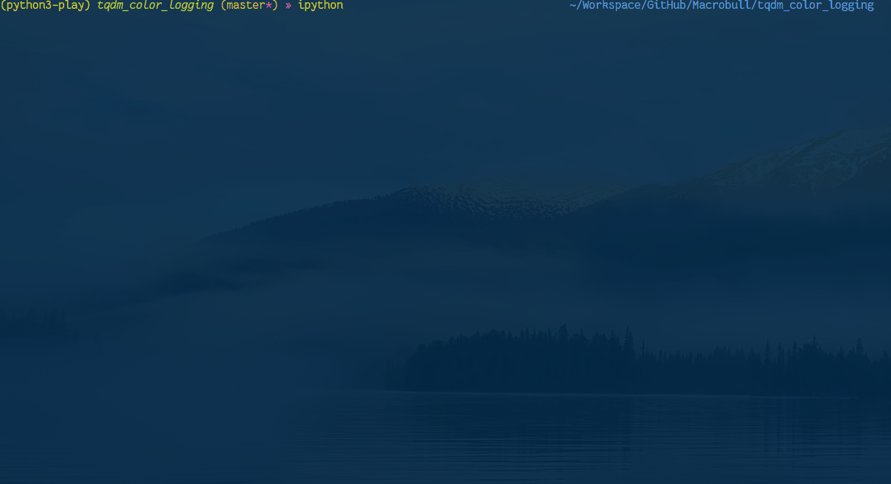

# tqdm_color_logging
Python colorized logging working with tqdm



## Usage
Just
```python
import tqdm_color_logging

tqdm_color_logging.basicConfig(...)
```
instead of
```python
import logging

logging.basicConfig(...)
```
